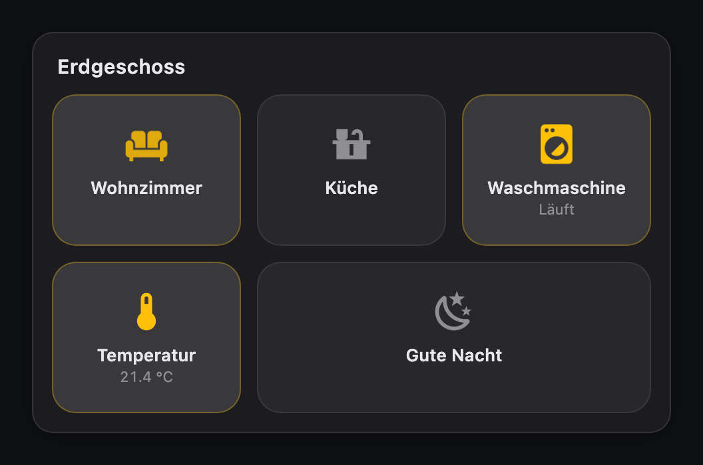
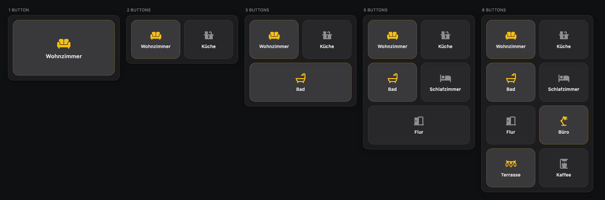
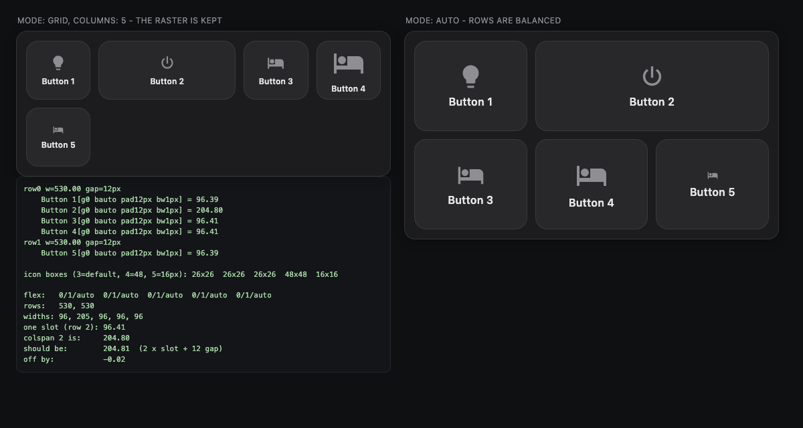
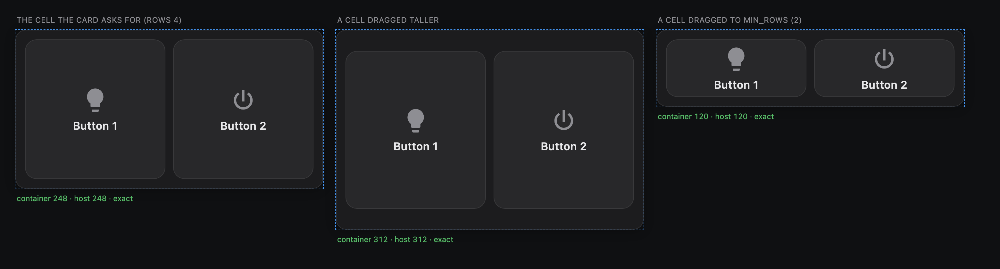
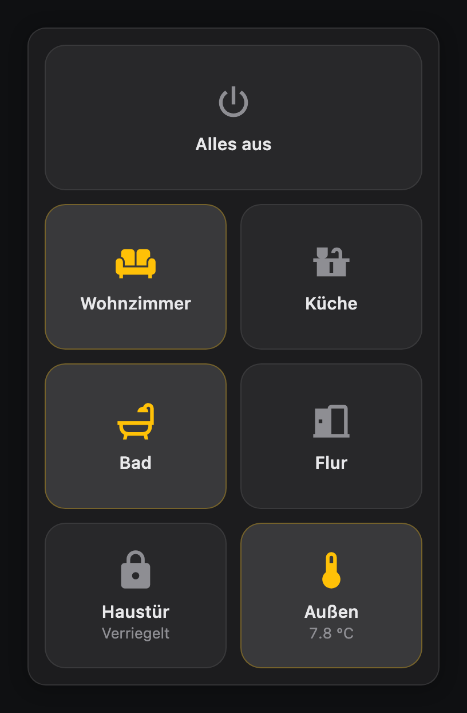
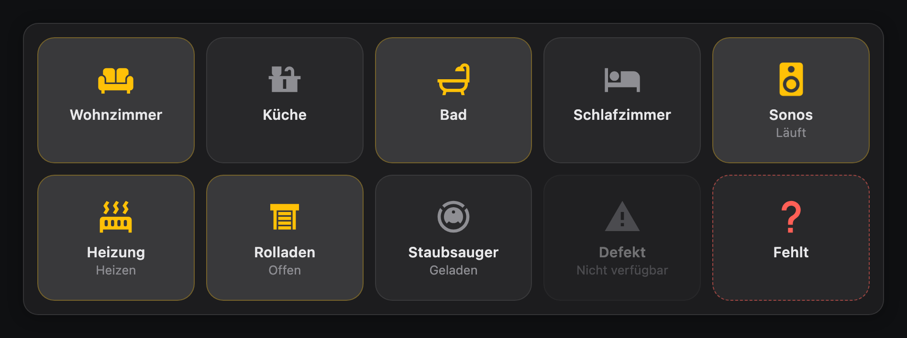
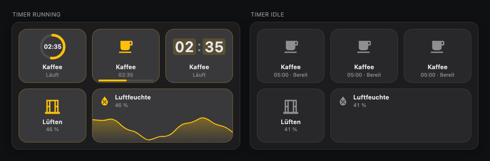
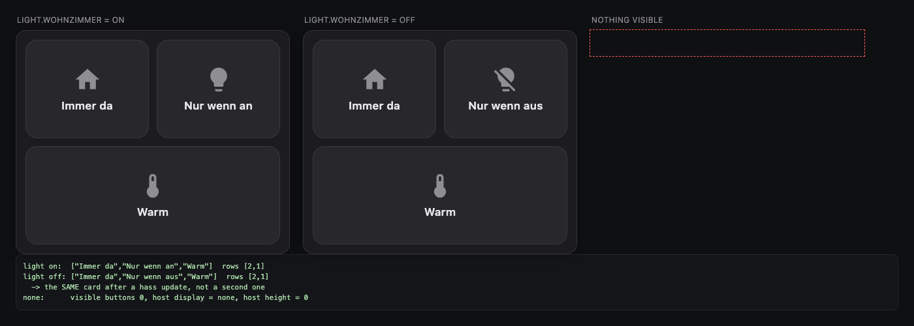
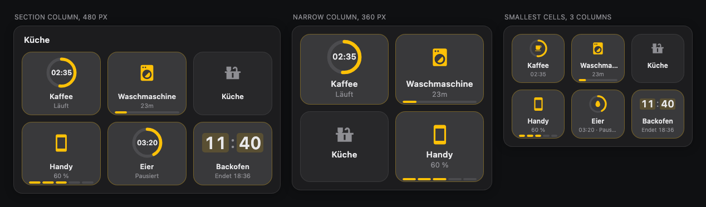
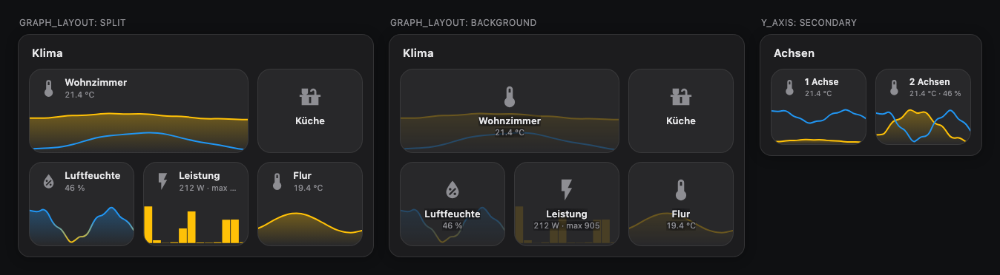

# Tessera Card

Buttons, countdowns, progress rings and graphs in one mosaic grid for Home
Assistant, built for wall-mounted dashboards.

Every item is a *tessera* — one tile of the mosaic. A button, a timer's ring, a
battery's segments, a sensor's graph: each sits in the same cell, with the same
surface, corners and accent, so a card that mixes them still reads as one calm
surface.

One file to install, no dependencies. The card looks the same quality with three
items as with twelve: the layout is computed from the item count and the measured
width, so there are no empty grid cells, no orphan rows and no layout jumps.

[](https://github.com/julezdean/lovelace-tessera-card/actions/workflows/ci.yml)
[](https://github.com/hacs/integration)
[](https://github.com/julezdean/lovelace-tessera-card/releases)

[](https://my.home-assistant.io/redirect/hacs_repository/?owner=julezdean&repository=lovelace-tessera-card&category=plugin)



---

## Contents

- [Installation](#installation)
- [Quick start](#quick-start)
- [How the layout works](#how-the-layout-works)
- [Configuration reference](#configuration-reference)
  - [Card options](#card-options)
  - [`layout`](#layout)
  - [`appearance`](#appearance)
  - [Items and types](#items-and-types)
  - [`item` (the cell of every item)](#item-the-cell-of-every-item)
  - [`button` (defaults for all buttons)](#button-defaults-for-all-buttons)
  - [Per-button options](#per-button-options)
  - [Templates](#templates)
  - [Per-button styling](#per-button-styling)
  - [Visibility](#visibility)
  - [Actions](#actions)
  - [Icons](#icons)
  - [Animations](#animations)
  - [Progress: `ring`, `bar`, `segments`, `digits`](#progress-ring-bar-segments-digits)
  - [Graph](#graph)
- [The visual editor](#the-visual-editor)
- [Examples](#examples)
- [Behaviour details](#behaviour-details)
- [Development](#development)

---

## Installation

### HACS

[](https://my.home-assistant.io/redirect/hacs_repository/?owner=julezdean&repository=lovelace-tessera-card&category=plugin)

That button opens the repository straight in your HACS. Install it there, then
reload the browser (Ctrl/Cmd-Shift-R).

Adding it by hand instead:

1. HACS → three-dot menu → **Custom repositories**
2. Repository: `julezdean/lovelace-tessera-card`, category **Dashboard**
3. Install **Tessera Card**
4. Reload the browser (Ctrl/Cmd-Shift-R)

### Manual

1. Download `tessera-card.js` from the
   [latest release](https://github.com/julezdean/lovelace-tessera-card/releases/latest)
   and copy it to `<config>/www/tessera-card.js`
2. **Settings → Dashboards → three-dot menu → Resources → Add resource**
   - URL: `/local/tessera-card.js`
   - Type: **JavaScript module**
3. Reload the browser

Confirm it loaded: the browser console prints `tessera-card v1.1.1` on
startup.

---

## Quick start

```yaml
type: custom:tessera-card
items:
  - name: Wohnzimmer
    icon: mdi:sofa
    entity: light.wohnzimmer

  - name: Küche
    icon: mdi:countertop
    entity: light.kueche

  - name: Gute Nacht
    icon: mdi:weather-night
    tap_action:
      action: call-service
      service: scene.turn_on
      target:
        entity_id: scene.gute_nacht
```

A button with an `entity` and no `tap_action` toggles that entity and opens
more-info on hold. That is usually all you need.

---

## How the layout works

The card does not use a fixed grid. It measures its own width, derives a column
count, and then splits the buttons into rows that are as equal as possible.

```
columns = clamp(round(width / layout.column_width), 1, min(max_columns, buttons))
rows    = ceil(total weight / columns)
```

Rows are filled front-heavy, so a leftover button ends up as a full-width button
at the bottom rather than as a lonely cell next to empty space:

| Buttons | Columns | Rows |
|---|---|---|
| 1 | 1 | `[1]` |
| 3 | 2 | `[2, 1]` |
| 5 | 2 | `[2, 2, 1]` |
| 7 | 3 | `[3, 2, 2]` — never `[3, 3, 1]` |
| 8 | 2 | `[2, 2, 2, 2]` |



Button height follows the column width — `clamp(min_button_size, width / 1.25,
max_button_size)` — which is why a single button does not become a huge tile and
twelve buttons stay tappable.

### Slots, columns and the two modes

Three options answer three different questions:

| | |
|---|---|
| `colspan` (editor: *Width in slots*) | how many slots one button occupies |
| `layout.columns` | how many slots a row holds |
| `layout.max_columns` | the ceiling for the count `auto` works out itself |

A row is a grid of equal tracks and a wide button spans several of them, so
`colspan: 2` is exactly as wide as two single buttons plus the gap between them
— not merely "about twice as wide".

The two modes differ in what happens once the slots are counted. `auto`
balances the rows, which is what keeps a leftover button from sitting alone
beside empty space. `grid` keeps the raster you asked for and fills each row to
capacity, even if the last one ends up half empty:

```yaml
layout: { mode: grid, columns: 5 }
items: [B1, B2 (colspan 2), B3, B4, B5]
```

```
mode: grid                         mode: auto
┌────┬─────────┬────┬────┐         ┌───────────┬───────────┐
│ B1 │   B2    │ B3 │ B4 │         │    B1     │    B2     │
├────┼─────────┴────┴────┘         ├───────┬───┴───┬───────┤
│ B5 │                             │  B3   │  B4   │  B5   │
└────┘                             └───────┴───────┴───────┘
```



Inside a button, the icon sits above the text. `button.layout: horizontal` puts
it beside the text instead — per card or per button:

```yaml
button:
  layout: horizontal     # vertical (default) | horizontal
```

It is a choice rather than a guess by height, because such a guess is usually
wrong: beside a 26 px icon a narrow button leaves the label a fraction of its
width, where stacking gives it all of it. Horizontal earns its place on buttons that are wide *and* flat — and the
card cannot tell those apart, since the height it works from is derived from
the width.

Names wrap onto a second line rather than being cut off, and a word too long
for the cell is split at a syllable in the page's language — Home Assistant
sets it — so it reads "Wohnzim-mer", not "Wohnzimm / er". Below 74 px of column
width the text is dropped entirely and only the icon remains.

Within a row, all buttons reserve room for the state line as soon as one of them
uses it. Otherwise the icons and names of neighbouring buttons would sit at
different heights, which is what makes a card look restless. Rows where nobody
shows a state stay vertically centred.

In the sections view the card asks for a grid cell that fits its buttons, and
takes whatever height it is actually given: it fills a cell dragged taller, and
shrinks the buttons down to the touch-target floor in a cell dragged to
`min_rows` rather than clipping them.



Portrait and landscape are the same mechanism, only with a different measured
width:

| Portrait (360 px column) | Landscape (900 px panel) |
|---|---|
|  |  |

The landscape image also shows the two error states: `sensor.kaputt` is
`unavailable` (dimmed), and `light.gibt_es_nicht` does not exist (dashed
outline). Neither takes the rest of the card down.

---

## Configuration reference

### Card options

| Option | Type | Default | Description |
|---|---|---|---|
| `type` | string | — | `custom:tessera-card` |
| `title` | string | — | Optional heading above the items |
| `items` | list | — | **Required**, at least one entry |
| `layout` | map | see below | Layout engine settings |
| `appearance` | map | see below | Card surface |
| `item` | map | see below | The cell every item sits in, whatever its type |
| `button` | map | see below | Defaults inherited by every button |
| `animation` | map | see below | Default animation for every button |

### `layout`

| Option | Type | Default | Description |
|---|---|---|---|
| `mode` | `auto` \| `grid` | `auto` | `auto` works the count out from the width; `grid` takes it from `columns` |
| `columns` | number \| `auto` | `auto` | **`grid` only.** Column count. A number on its own implies `mode: grid`, but never overrides an explicit `mode: auto` |
| `column_width` | number | `172` | **`auto` only.** The column width the automatic count aims for |
| `max_columns` | number | `6` | **`auto` only.** Ceiling for the automatic count |
| `gap` | number \| string | `12` | Space between buttons |
| `min_button_size` | number | `88` | Lower bound for button height (px) |
| `max_button_size` | number | `170` | Upper bound for button height (px) |

In `auto`, widen the buttons by *raising* `column_width` — that produces fewer,
larger columns, and `max_columns` caps the result.

`max_columns` deliberately does **not** apply in `grid` mode: there the count is
stated outright, and a second ceiling on top of it would only be a way to
silently ignore what was asked for. An explicit count is capped at 12, beyond
which nothing is a touch target any more.

### `appearance`

The card renders a real `<ha-card>`, so its surface, corner radius, outline and
shadow come from the active theme. These options override the theme where you
want them to; left unset, they stay out of its way.

| Option | Type | Default | Description |
|---|---|---|---|
| `background` | CSS colour | from the theme | Sets `--ha-card-background` |
| `radius` | number \| string | from the theme | Sets `--ha-card-border-radius` |
| `padding` | number \| string | `14` | Inner padding — the card's own, no theme equivalent |
| `shadow` | boolean | from the theme | `false` sets `--ha-card-box-shadow: none` |

### Items and types

Every entry of `items` has a `type`, which decides what the cell shows and which
options it takes. An entry without `type` is a button:

```yaml
items:
  - entity: light.kueche        # type: button
  - type: button
    entity: light.flur
```

| `type` | |
|---|---|
| `button` *(default)* | An icon, a name and an optional state line — everything described below |
| `ring` | A countdown or a value as a ring where the icon would be, the time inside it |
| `bar` | A button's icon and name, the value in the state line, a bar along the bottom |
| `segments` | The same with the bar in steps — five for a battery, twelve for an hour |
| `digits` | The time or value in large digits where the icon would be |
| `graph` | A sensor's recent history, full-bleed along the bottom of the cell |

The progress types are described under [Progress](#progress-ring-bar-segments-digits),
the graph under [Graph](#graph).

Some options belong to the item rather than to its type, and every type has
them: `entity`, `colspan`, `visibility`, the three actions, `style`,
`active_when`, and the cell options below.

**`active_when`** decides when an item counts as active — lit outline and
accent, a progress fill in colour, animations with `when: active` — instead of
its type's own rule. It is a template:

```yaml
- name: Lüften
  icon: mdi:window-open-variant
  entity: sensor.luftfeuchte
  active_when: "[[[ return Number(entity.state) > 60 ]]]"
```

Without it, a button follows Home Assistant's active semantics, a countdown is
active while it runs or is paused, and a graph never is. With it, the template
alone decides — a template that fails reads as not active.

**`show_drawing`** — for the progress types and the graph — decides whether the
drawing is shown: `always` (the default), `active`, or a template. Without its
drawing an item looks like a button: a ring or digits become the icon, a bar or
a graph disappears, the value moves to the state line. The row keeps the room it
had, so nothing moves when a timer starts:

```yaml
- type: ring
  entity: timer.kaffee
  show_drawing: active          # the ring only while the timer runs
```



Hiding the whole item is still [`visibility`](#visibility); `show_drawing`
keeps the item and only drops its drawing. An entry with a type this version does not know is shown as
a dashed cell with the reason in it; the rest of the card keeps working.

### `item` (the cell of every item)

Every item sits in the same cell, so a card mixing kinds of item still has one
surface, one corner radius and one accent. These keys set that cell for all
items. A type's own defaults block (`button:`) may set them too and wins over
`item:`, and the item itself wins over both.

| Option | Type | Default | Description |
|---|---|---|---|
| `radius` | number \| string | `18` | Corner radius |
| `background` | CSS colour | subtle overlay | Inactive background |
| `active_background` | CSS colour | slightly brighter | Active background |
| `active_color` | CSS colour | `--state-active-color` | Accent for icon and outline |
| `name_size` | number \| string | derived from height | Size of the name |
| `name_weight` | number | `550` | Weight of the name, 100–900 |
| `label_size` | number \| string | 2 px under the name | Size of the line under the name: the state, a value, a `label` |
| `label_weight` | number | `400` | Weight of that line, 100–900 |
| `icon_size` | number \| string | derived from height | Fixed size of the icon |
| `icon_color` | CSS colour | secondary text | Inactive icon colour |
| `show_name` | boolean | `true` | Show the name line |
| `show_icon` | boolean | `true` | Show the icon. Without it the icon's room goes too, and the text moves to the middle |
| `press_effect` | `scale` \| `fade` \| `none` | `scale` | Touch feedback |

`button:` may carry them too, and wins over `item:` for buttons. The visual
editor shows them all under **Item defaults** and writes them to `item:`. Every one of them can also be set on a single item,
of any type.

### `button` (defaults for all buttons)

What only buttons have. Every key here can also be set on an individual
button, where it wins. In the editor, `layout` sits under **Item defaults** as
*Icon and text (buttons)*.

| Option | Type | Default | Description |
|---|---|---|---|
| `show_state` | boolean \| `auto` | `auto` | See below |
| `layout` | `vertical` \| `horizontal` | `vertical` | Icon above or beside the text |

**`show_state: auto`** shows the state only for domains whose state carries a
value — `sensor`, `climate`, `cover`, `media_player`, `lock`, … For a light or a
switch the colour already says everything, so the extra line is left out. Set
`true` or `false` to override.

### Per-button options

| Option | Type | Description |
|---|---|---|
| `name` | string \| `false` | Label. Defaults to the entity's friendly name |
| `label` | string | Secondary line when no state is shown |
| `icon` | string \| map | See [Icons](#icons) |
| `entity` | string | Entity for state, colour and default actions |
| `colspan` | number \| `full` | Slots this button occupies (default `1`); `full` spans the whole row |
| `visibility` | list | Conditions under which the button is shown, see [Visibility](#visibility) |
| `style` | string | CSS declarations for this button, see [Per-button styling](#per-button-styling) |
| `active_color` | CSS colour | Accent for this button's icon and outline when active |
| `icon_color`, `background`, `active_background` | CSS colour | Per-button overrides of the card defaults |

`active_background` takes precedence over `background` while the button is on.
A button given only a `background` keeps that colour in both states — the
active state then shows on its icon and outline rather than on the surface.
| `state_display` | string | Template for the state line, see below |
| `tap_action` / `hold_action` / `double_tap_action` | map | See [Actions](#actions) |
| `animation` | map \| string | See [Animations](#animations) |

**`state_display`** is a small placeholder syntax, not Jinja:

```yaml
state_display: "{{state}} · {{attributes.current_temperature}} °C"
```

Available: `{{state}}` (formatted), `{{raw_state}}`, `{{name}}`, and any
attribute by name or as `{{attributes.x}}`.

### Templates

Presentation fields can carry JavaScript, in the `[[[ ... ]]]` form that
`custom:button-card` established:

```yaml
items:
  - entity: binary_sensor.alle_fenster
    name: Fenster
    label: |
      [[[
        const offen = entity.attributes.anzahl_offen ?? 0;
        return entity.state === 'on' ? `${offen}` : '';
      ]]]
```

Available inside a template: `entity` (this button's state object, or
`undefined`), `states`, `user`, `hass`, and `variables` (from a `variables:`
block on the card).

A template filling the whole string returns its value as-is, so it can yield a
number or a boolean. One embedded in text is substituted into it:
`label: "Status: [[[ return entity.state ]]] now"`.

Templated fields: `name`, `label`, `state_display`, `icon`, `style`,
`color`, `active_color`, `icon_color`, `background`, `active_background`,
`show_name`, `show_state`. Deliberately **not** templated: `entity` (it is what
state tracking hangs on), `colspan` (it would rebuild the layout on every
update) and the actions (structure, not appearance).

A template that throws costs its own field and nothing else — the button keeps
rendering, and the error goes to the browser console.

Templates are evaluated JavaScript from the dashboard's configuration, the same
trade-off every templating card in this ecosystem makes. Your own config is
yours; be as careful with a copied one as you would be with any code.

### Per-button styling

Each button takes a `style` of CSS declarations — not a rule, just what would
go inside one — and it is templated like everything else:

```yaml
- entity: binary_sensor.alle_fenster
  style: |
    [[[
      return entity.attributes.anzahl_nicht_verfuegbar > 0
        ? 'border: 2px solid var(--error-color)'
        : '';
    ]]]
```

Colours are per button too — `active_color` is the accent its icon and outline
take when active, and like everything else it can be a template:

```yaml
- entity: sensor.wohnzimmer_temperatur
  active_color: |
    [[[ return Number(entity.state) > 20 ? '#ff9f43' : '#54a0ff' ]]]
```

In the editor these live under **Colours** on the button's page.

**On a translucent card** — a glass theme setting `ha-card { background:
rgba(...) }` — the buttons are translucent too, because their own surface is a
light overlay rather than a colour. Give them one and they stop showing the
wallpaper through:

```yaml
button:
  background: "#2a2724"
  active_background: "#3a332c"   # optional, if you want a distinct "on" tone
```

That is preferable to forcing it with `card_mod` and `!important`, which would
also override `active_background` and flatten the on/off difference.

**Themes** reach this card like any other. Because it renders a real `ha-card`,
a `card-mod-card` block in your theme applies to it — `ha-card { ... }` selects
something here. Earlier versions drew their own surface instead, which is why
this card was the one that ignored the theme.

**card_mod** works too, and does not need anything per button. It targets the
card element and injects into this card's shadow root, so a selector reaches a
single button directly. Every button carries the attributes to find it by:

| Attribute | |
|---|---|
| `data-entity` | the button's entity |
| `data-domain` | that entity's domain |
| `data-state` | its current state, kept up to date |
| `data-active` | `true` / `false`, HA's active semantics |
| `data-index` | position in the config |
| `data-name` | the configured name, when it is not a template |

```yaml
card_mod:
  style: |
    .btn[data-entity="binary_sensor.alle_fenster"][data-state="on"] {
      border: 2px solid var(--error-color) !important;
    }
```

There is no `card_mod` *per button*: card-mod knows cards, not the elements
inside them. The selector above is the equivalent, and `style` is the option
that needs no extra integration at all.

### Visibility

A button can be shown only under certain conditions, using Home Assistant's own
condition grammar — the same one `visibility:` uses in sections and the
conditional card:

```yaml
items:
  - name: Waschmaschine
    icon: mdi:washing-machine
    entity: binary_sensor.waschmaschine
    visibility:
      - condition: state
        entity: binary_sensor.waschmaschine
        state: "on"
```

A list means **all** of its conditions must hold. Supported:

| `condition` | Keys |
|---|---|
| `state` | `entity`, `state` or `state_not` (a value or a list of values) |
| `numeric_state` | `entity`, `above`, `below`, optional `attribute` |
| `screen` | `media_query` |
| `user` | `users` (a list of user ids) |
| `and` / `or` / `not` | `conditions` |

`conditions:` is accepted as a synonym for `visibility:`, since that is the
spelling the conditional card uses.

Two details worth knowing:

- **Hiding a button re-runs the layout.** The remaining buttons are re-balanced
  rather than leaving a hole, so a card whose four buttons drop to three ends up
  as two plus one, not as three buttons and a gap.
- **If every button is hidden, the card hides itself**, the way a conditional
  card does, instead of leaving an empty surface on the dashboard.
- An **unknown condition type counts as met**. A typo leaves the button where it
  is rather than making it disappear with no clue as to why.

`screen` conditions are watched with a media query listener, so rotating a
tablet re-evaluates them; nothing needs to be reloaded.



Each button's page also has a `{}` button that swaps the form for the raw YAML
of that one button — the same affordance as elsewhere in Lovelace. It is the
way to reach what a form cannot express: templates, state-keyed icon maps, and
anything a later version adds. Invalid YAML is not written back, so the card
does not fall apart while you type.

In the visual editor, conditions are edited on a button's page under
**Visibility**, using Home Assistant's own conditions editor — the same control
the conditional card and section visibility use. It is loaded on demand; if it
cannot be loaded, the section falls back to a note and the conditions stay
editable in YAML, untouched by anything else you change.

### Actions

Home Assistant's own action grammar. `tap_action`, `hold_action` and
`double_tap_action` all accept:

| `action` | Additional keys |
|---|---|
| `toggle` | `entity` (falls back to the button's) |
| `more-info` | `entity` |
| `call-service` / `perform-action` | `service`, `data`, `target` |
| `navigate` | `navigation_path` |
| `url` | `url_path`, `new_tab` |
| `assist` | `pipeline_id`, `start_listening` |
| `fire-dom-event` | any keys, emitted as `ll-custom` |
| `none` | — |

Defaults: `tap_action` toggles the entity, `hold_action` opens more-info,
`double_tap_action` is `none`. A button without an entity and without an
explicit action does nothing rather than erroring.

The shorthand from HA's own docs works too:

```yaml
action:
  service: light.turn_on
  target:
    entity_id: light.wohnzimmer
```

`toggle` handles domains without a `toggle` service correctly: locks are locked
or unlocked according to their state, buttons are pressed, scenes and scripts
are turned on.

#### Confirmation

Every action takes `confirmation: true` or `confirmation: { text }`, as in
Home Assistant's own action grammar — so a tap, a hold and a double tap can
each ask for it independently:

```yaml
- name: Alles aus
  icon: mdi:power
  tap_action:
    action: perform-action
    perform_action: light.turn_off
    target: { entity_id: all }
    confirmation: true
  hold_action:
    action: perform-action
    perform_action: script.haus_verlassen
    confirmation:
      text: Nochmal halten zum Bestätigen
```

It does not open a modal. The first gesture arms the item — it turns red and
shows the confirmation text — and a **tap** within four seconds runs what was
armed. The four seconds start when the finger comes off, so holding on after
the item armed does not use them up. A tap confirms whatever armed it: on an item armed by a hold, the tap
runs the hold action, not the tap action. Holding again only arms it anew.
Nothing happens if you walk away. The built-in texts are English
(`Tap again to confirm`, `Tap to confirm`), so set `text` if your dashboard is in another
language.

The visual editor shows a switch below each action and writes the setting onto
the action.

### Icons

```yaml
icon: mdi:lightbulb
```

State-dependent, keyed by state value:

```yaml
icon:
  "on": mdi:lightbulb
  "off": mdi:lightbulb-outline
  default: mdi:help-circle-outline
```

Quote `on` and `off` — unquoted, YAML turns them into booleans. The card accepts
both spellings anyway, but quoting is clearer.

Without an `icon`, the card renders `<ha-state-icon>`, so you get the same icon
Home Assistant would pick for that entity.

### Animations

```yaml
animation:
  type: pulse
  duration: 2s
  intensity: 0.8
  when: "on"
```

Types: `none`, `pulse`, `breathe`, `bounce`, `spin`, `shake`, `glow`, `blink`,
`wobble`. An unknown type degrades to `none` instead of breaking the card.

`intensity` (0–3, default 1) scales the amplitude. `duration` accepts `2s` or a
bare number.

**`when`** decides when the animation runs:

| Value | Animates when |
|---|---|
| `active` *(default)* | the entity is on / open / playing / … |
| `inactive` | the entity is off |
| `always` | always |
| `"on"`, `"heat"`, … | the state matches exactly |
| `["heating", "cooling"]` | the state matches any entry |
| `{ above: 25 }` | numeric state above 25 |
| `{ above: 10, below: 20 }` | numeric state within the range |
| `unavailable` | the entity is unavailable |

`state:` is accepted as a synonym for `when:`.

Set on the card, it applies to every button; set on a button, it overrides the
type while still inheriting the duration:

```yaml
animation:
  type: breathe
  duration: 3s

items:
  - entity: binary_sensor.waschmaschine
    animation:
      type: pulse        # duration stays 3s
```

Animations are pure CSS and honour `prefers-reduced-motion: reduce`.

---

### Progress: `ring`, `bar`, `segments`, `digits`

Four types draw a proportion: a timer running down, the time a washing machine
has left, a battery, a value between two bounds. They read the same sources and
take the same options; they differ only in the drawing.



```yaml
items:
  - type: ring
    entity: timer.kaffee
    hold_action:
      action: perform-action
      perform_action: timer.cancel
      target: { entity_id: timer.kaffee }
  - type: bar
    entity: sensor.waschmaschine_restzeit    # "23" min
    progress: { window: 2h }
  - type: segments
    entity: sensor.handy_akku
    segments: 5
  - type: digits
    entity: sensor.backofen_fertig           # a timestamp
```

They sit in the same cell as a button and follow its rules: the fill is the
accent while the item runs and the dimmed text colour while it does not, the
outline lights up the same way, and the name sits where a button's name sits.
A row holding a ring or digits gives every cell the same room above the name,
so names still line up across the row. A tap opens more-info; hold does nothing
until you say what it should do.

**What counts as on.** A timer that runs or is paused — the same as a button on
that timer. Idle and finished are off. A value is on while it is above its
minimum.

#### Where the value comes from

`source` picks how the entity is read; `auto` (the default) works it out:

| `source` | Reads | Detected when |
|---|---|---|
| `timer` | a `timer` entity: running, paused, idle, finished | the entity is a `timer` |
| `timestamp` | a point in time — the item counts down to it | `device_class: timestamp`, `input_datetime`, or the state is a date-time |
| `remaining` | the time left as a number, `23` min | `device_class: duration`, or a unit of s, min, h or d |
| `percentage` | a value on 0–100 | unit `%`, or a battery, humidity or moisture class |
| `numeric` | a value on `progress.min`–`max`, or on the range the entity declares | the state is a number |
| `attribute` | one attribute, read as a time or a number | set `source.attribute` |
| `template` | what `source.template` returns | — |

A **remaining-time sensor** counts from the moment it reported: 23 minutes
reported 90 seconds ago reads 22. It counts down on its own between reports,
in the sensor's own unit — a sensor that knows minutes shows minutes, because
the seconds would be invented. A new report moves the end; that is the machine
recalculating, not jitter.

A **template** returns a number, a timestamp, or a mapping for the cases that
need more than one number:

```yaml
source:
  type: template
  template: |
    [[[
      const a = states['sensor.spuelmaschine'].attributes;
      return { end: a.fertig_um, duration: a.programmdauer * 60, status: a.pausiert ? 'paused' : 'active' };
    ]]]
```

Keys: `end`, `start`, `duration` (seconds or `H:MM:SS`), `remaining`,
`status` (`active`, `paused`, `idle`, `finished`), `value`, `min`, `max`,
`unit`, `name`.

`source` can also be a mapping with `attribute`, `map` (state → value, before
it is read) and `naive_timezone` (`server` or `browser`, for timestamps without
an offset).

#### How full it is

A timer knows its duration. A timestamp or a remaining-time sensor only knows
when it ends, so it draws a full, muted ring until it is told the span:

| `progress:` | |
|---|---|
| `window` | the whole span: `2h`, `90m`, `1d 2h`, seconds, or `{ entity, attribute }` holding a duration |
| `start` / `end` | a point in time, or `{ entity, attribute }` |
| `min` / `max` | the range of a value |
| `direction` | `remaining` *(default)*: empties as time runs out; `elapsed`: fills |

#### What it shows

| Option | Default | |
|---|---|---|
| `format` | `auto` | `auto`, `MM:SS`, `HH:MM:SS`, `DD:HH:MM:SS`, `SS`, `short` (2h 05m), `long`; or a mapping with `style`, `show_seconds` (and days/hours/minutes), `largest_units`, `decimals` |
| `on_complete` | `show_zero` | `show_zero`, `show_text` (with `text`), `count_up` — the time since it ended |
| `label` | — | The state line, with `{{value}}`, `{{status}}`, `{{end_time}}`, `{{percentage}}`, `{{name}}`, `{{state}}`, `{{attributes.x}}`; or a template |
| `status_labels` | — | Your own words for `active`, `paused`, `idle`, `finished` |
| `name`, `icon`, `show_name` | from the entity | As on a button |

The state line of a ring or digits says how it is going — *Running*, *Paused*,
or when a timestamp ends. On a bar it shows the value. Status texts come in
English and German, following Home Assistant's language.

Hiding an item when it is not running is a job for
[`visibility`](#visibility), not an option of the type:

```yaml
visibility:
  - condition: state
    entity: timer.kaffee
    state_not: idle
```

A timestamp is the exception: when its time passes, nothing about the entity
changes, so no condition can see it. The item stays and shows its
`on_complete`.

#### The drawing

| Option | Types | Default | |
|---|---|---|---|
| `inner` | ring | `auto` | `value`, `percentage`, `icon`, `none`. `auto` shows the value while it can be read at the ring's size and the icon otherwise, with the value in the state line |
| `thickness` | ring, bar, segments | ring `10`, bar `4` | ring: percent of the diameter; bar and segments: px, at most 6 — the bar lives in the cell's bottom padding |
| `arc` | ring | `360` | Degrees drawn; below 360 it is a gauge open at the bottom |
| `segments` | segments | `10` | How many |
| `tiles` | digits | `true` | Each group of digits on its own tile |
| `rounded`, `track` | ring, bar, segments | `true` | Rounded ends; the unfilled track |
| `gradient` | ring, bar, segments | `false` | The fill runs from the accent to `colors.secondary` |

#### Colour and animation

The fill is the accent — `active_color`, as on a button. `colors` changes it
with the state of the countdown:

```yaml
colors:
  basis: remaining_seconds      # progress (default) | remaining_seconds | value
  thresholds:
    - { value: 0, color: red }
    - { value: 30, color: amber }
    - { value: 120, color: green }
```

`colors.mode: gradient` with `start` and `end` blends along the course instead;
`colors.track` sets the track. Home Assistant's colour names (`red`, `amber`, …)
and theme variables work alongside any CSS colour.

`animation` is a button's animation on the drawing, with two more moments for
`when`: `finishing` (the last `finishing_seconds`, default 60) and `finished`.

```yaml
animation: { type: pulse, when: finishing }
```

#### Defaults per type

Like `button:`, each type has a defaults block: `ring:`, `bar:`, `segments:`,
`digits:`.

```yaml
ring:
  thickness: 14
  colors: { thresholds: [{ value: 0, color: red }, { value: 60, color: green }], basis: remaining_seconds }
```

---

### Graph

A sensor's history over the last hours, modelled on
[mini-graph-card](https://github.com/kalkih/mini-graph-card): its options where
they make sense in a cell, drawn full-bleed along the bottom of the cell and cut
by its rounded corners.



```yaml
items:
  - type: graph
    entity: sensor.wohnzimmer_temperatur
    colspan: 2
    lines:
      - entity: sensor.aussen_temperatur
  - type: graph
    entity: sensor.leistung
    graph: bar
    points_per_hour: 0.5
    label: "{{value}} · max {{max}}"
```

**Two arrangements**, set with `graph_layout`:

| | |
|---|---|
| `split` *(default)* | The text on top — icon beside name and value, as a button with `layout: horizontal` has it — and the graph below |
| `background` | A button's arrangement, with the graph behind it, muted |

`split` keeps the text as readable as on a button. `background` looks more of a
piece, at a cost: where a bar or a bright line runs behind the state line, its
contrast drops from 4.5:1 to about 3.7:1 in the demo, even with the halo the text
gets there. Next to a button, `split` puts the name higher than the button's —
it sits at the top of its cell, not in the middle.

A graph is a display, not a switch: it never counts as active, whatever its
value, so a wall of temperatures does not light up. A tap opens more-info.

#### Options

| Option | Default | |
|---|---|---|
| `hours_to_show` | `24` | How far back, in hours (at most 240 — history is kept 10 days by default) |
| `points_per_hour` | `1` | Resolution. Buckets are aligned to the clock, so the graph moves once per bucket |
| `aggregate_func` | `avg` | Per bucket: `avg`, `median`, `min`, `max`, `first`, `last`, `sum`, `delta` (max − min), `diff` (last − first) |
| `graph` | `line` | `line` or `bar` |
| `fill` | `fade` | `fade`, `true` (solid) or `false` |
| `smoothing` | `true` | Curves through the points, as mini-graph-card draws them |
| `line_width` | `2` | px |
| `graph_layout` | `split` | See above |
| `graph_height` | `50%` | Share of the cell, or px. In `split` it never takes the room the text needs |
| `lower_bound`, `upper_bound` | from the data | `15` is hard; `~15` is soft — the data may push past it |
| `min_bound_range` | — | The smallest span of the scale, so 21.3 to 21.4 °C is not a mountain |
| `logarithmic` | `false` | A log scale |
| `attribute` | — | Draw an attribute instead of the state (`forecast.0.temperature` works) |
| `state_map` | — | State → number, to draw `on`/`off` and the like |
| `value_factor` | `0` | Scale by a power of ten: `-3` turns W into kW |
| `unit`, `decimals` | from the entity | For the value in the state line and the placeholders |
| `label` | the state | The state line, with `{{value}}`, `{{min}}`, `{{max}}`, `{{avg}}` (of what is drawn), `{{unit}}`, `{{name}}`, `{{state}}`, `{{attributes.x}}` |
| `bar_spacing` | `2` | Between bars |

**Colours.** The main line is the accent (`active_color`). `colors.thresholds`
colours it by value, along its height — `color_thresholds` from a mini-graph-card
config works too; `color_thresholds_transition: hard` gives each band one colour
instead of a blend:

```yaml
colors:
  thresholds:
    - { value: 40, color: amber }
    - { value: 50, color: blue }
```

**More lines** go under `lines:`, each with `entity` and optionally `attribute`,
`color`, `fill`, `aggregate_func`, `state_map`, `smoothing` and `y_axis`. Without a colour a
line takes the next of the accent, `--blue-color`, `--orange-color`,
`--green-color`, `--purple-color` and `--red-color`, so it follows the theme. Only
the main line is filled by default. More than two lines want a wider cell —
`colspan: 2` or more.

**A second axis.** All lines share one scale unless told otherwise, which is
right for the same quantity in two places — inside and outside. For two
different quantities it is not: next to a humidity around 50 %, a temperature
around 21 °C becomes a straight line. `y_axis: secondary` gives a line a scale
of its own, over the same height, as in mini-graph-card:

```yaml
- type: graph
  entity: sensor.temperatur_wohnung
  lines:
    - entity: sensor.luftfeuchtigkeit_wohnung
      y_axis: secondary
  label: "[[[ return entity.state + ' °C · ' + states['sensor.luftfeuchtigkeit_wohnung'].state + ' %' ]]]"
```

The secondary scale takes `lower_bound_secondary`, `upper_bound_secondary` and
`min_bound_range_secondary`. There are no axis labels — a cell has no room
for them — so the state line is where both values are read: the label above
shows how. The main line and the thresholds always use the primary scale.

**Where the data comes from.** Home Assistant's `history/stream`, the same
subscription its own history graphs use: the history once, then every new
state as it is recorded, and again by itself after a lost connection. Nothing
is cached in the browser, so nothing can be stale. Long-term statistics — for
weeks and months, or a bar per day — are not read yet.

`lines`, `state_map` and the thresholds are YAML-only; the editor keeps them as
they are.

---

## The visual editor

The card ships an editor, so it can be configured by clicking rather than by
writing YAML. Card options - layout, appearance, item and button defaults,
animation - are collapsible sections. The items are a list below them: click
one to open its own page with the options its type has - for a button entity,
icon, name, width, the three actions and its animation. **+ Add item** asks
which type to add, and the list reorders and deletes them.

The type of an item can be changed on its page. What both types read - entity,
name, icon, actions, the cell - carries over. What only the old type has is
set aside while the editor is open, so switching a ring to a bar and back does
not lose it; the saved config carries only what the current type reads.

Thresholds, a `window` read from an entity, and `colors` stay YAML-only; the
form keeps them as they are when you edit other fields.

Anything left at its default is not written to the config, so opening the
editor on a three-line YAML card does not turn it into fifty lines.

Two things stay YAML-only, because a form would make them worse rather than
better:

- **State-dependent icons** (`icon: { "on": ..., "off": ... }`). The editor
  keeps such a mapping when you edit other fields rather than flattening it to
  a single icon.
- **`state_display` placeholders** beyond plain text.

## Examples

Complete configurations are in [`examples/`](examples/):

| File | What it shows |
|---|---|
| [`small-wallmount.yaml`](examples/small-wallmount.yaml) | Three buttons, minimal configuration |
| [`large-dashboard.yaml`](examples/large-dashboard.yaml) | Ten buttons, tuned layout, confirmation |
| [`mixed-dashboard.yaml`](examples/mixed-dashboard.yaml) | Entities, navigation, service calls, animations |
| [`kitchen-timers.yaml`](examples/kitchen-timers.yaml) | The four progress types with a button: a timer, a machine's time left, a battery, a timestamp |
| [`climate-graphs.yaml`](examples/climate-graphs.yaml) | Graphs: two temperatures in one, humidity with thresholds, power as bars |

---

## Behaviour details

**Touch.** A plain tap fires immediately on release. The 250 ms double-tap
window is opened *only* when a `double_tap_action` is actually configured —
responsiveness on a wall tablet matters more than universal double-tap support.
Hold fires at 500 ms. Dragging more than 12 px cancels the gesture, so scrolling
a dashboard does not trigger buttons.

**Buttons, scenes and events.** `button`, `input_button`, `scene` and `event`
entities have no on or off — their state is the time of the last press. Read as
a state, that would be active forever after the first press, so these buttons
stay inactive and light up for one second whenever the timestamp changes,
whether the press came from this card or from anywhere else. An animation on
`when: active` plays during that second. A button that was never pressed has
the state `unknown`; it is shown as a normal button, not as unavailable.

**Performance.** The DOM is built once. A `hass` update compares one signature
string per button and touches the DOM only for buttons that actually changed.
The `ResizeObserver` reads width only — reading height would feed the layout
back into itself — and re-lays out only when the column count or button height
actually changes.

**Accessibility.** Buttons are real `<button>` elements with `aria-label` and
`aria-pressed`, reachable and operable by keyboard, with a visible focus ring.
Nothing depends on hover.

**Themes.** All colours come from Home Assistant theme variables
(`--ha-card-background`, `--primary-text-color`, `--state-active-color`, …), so
light and dark themes both work. Every `color-mix()` has a plain `rgba()`
fallback in front of it for the older webviews found on wall tablets.

**Faults.** An entity in the state `error` — a vacuum stuck under the sofa, a
mower off its boundary — gets a red dashed outline instead of the active one. It
is not counted as active, so it does not light up like a running device either;
`active_when` can still force that, but the red outline stays.

**Errors.** A misconfigured button shows a dashed outline; the rest of the card
keeps working, and so does an item of a type the card does not know. A card
without `items` shows a readable error instead of a blank space.

---

## Development

The card is written in TypeScript under `src/` and bundled into the single
file Home Assistant loads. That file is built, not committed: a release
attaches it as an asset, which is where HACS looks first.

```bash
npm install
npm run build            # dist/tessera-card.js
npm run check            # formatting, lint, types, build, tests - what CI runs
npm run screenshots      # build, then regenerate docs/images/ from the demo harness
```

`src/main.ts` describes the layout of the source. The card owns the grid and
the cell each item sits in; each item type under `src/items/` owns what is
inside its cell, its options and its page in the editor.

`tools/demo/` is a harness that imports the built `dist/tessera-card.js`
with a mock `hass` object and stubs for `<ha-icon>`, `<ha-state-icon>` and
`<ha-form>`, so the images in this README always show the current code. Run
`npm run build`, serve the repo root and open
`tools/demo/index.html?scene=overview`.

Scenes: `overview`, `counts`, `portrait`, `landscape`, `inner` (icon above vs. beside the
text), `theme` and `opaque`
(how a card-mod theme reaches the card, and how to keep buttons opaque under
one), `constrained` (how the
card behaves in a sections grid cell), `colspan` (both layout modes with the
measured widths printed, so the span arithmetic is checkable), `visibility`, `compact`, `animations`,
`typography` (name and second line sized and weighted, the icon left out, with
the computed values printed), `editor`, `progress` (the four progress types at three cell sizes, on a fixed
clock), `graph` (both arrangements, on a computed history), `drawing`
(`show_drawing` and `active_when`, timer running and idle) and `tick` (a countdown on the real clock, with a log of what it shows
and how often it writes to the DOM).

The `editor` scene is for development only and is deliberately not
screenshotted: it renders against a stub, not against Home Assistant's real
`ha-form`, so an image of it would show a form that exists nowhere. It does
verify the wiring - schema read, `value-changed` handled, config written back,
`config-changed` emitted.

`?hide=text` renders a scene with the text made transparent. Compared with the
normal render, it tells the pixels behind the text from the text itself, which
is how the contrast figures for `graph_layout: background` were measured.

The window sizes in `tools/screenshots.sh` are measured, not guessed — if you
add a button to a scene, re-measure and update them.
